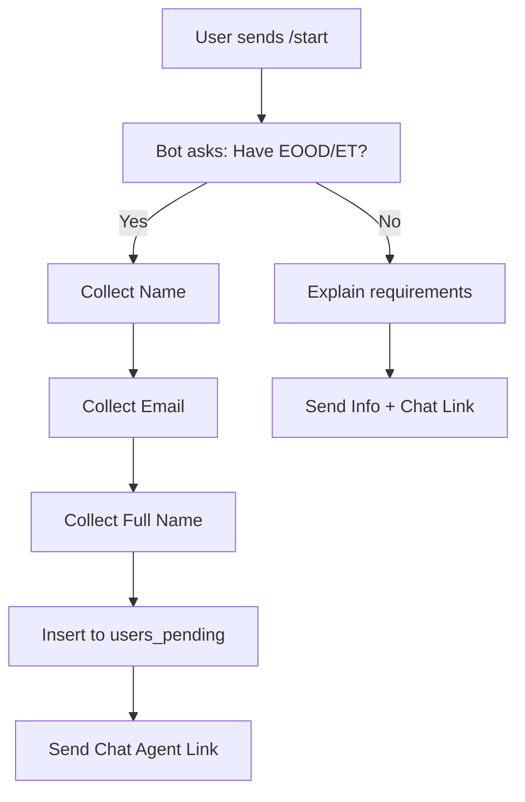

# 🤖 Telegram Bot - User Acquisition System
**Date:** 3 December 2025  
**Purpose:** Automated user acquisition, lead generation, and chat agent navigation  
**Status:** Design ready, implementation in progress

---

## 📋 Overview

This Telegram bot system automates user acquisition and directs potential clients to the Horizons chat agent (8 AI personalities) for Wallester card services.

### Key Features
1. **Smart Message Responses** - Automated replies to DMs
2. **Group Ad Posting** - Scheduled promotional posts
3. **Information Collection** - Gather user data for verification
4. **Chat Agent Navigation** - Direct users to web chat interface
5. **Supabase Integration** - Store leads in users_pending table

---

## 🏗️ Architecture

```
┌─────────────────────────────────────────────────────────┐
│                    Telegram Bot                          │
│                                                          │
│  ┌──────────────┐  ┌──────────────┐  ┌──────────────┐  │
│  │   Message    │  │    Group     │  │  Information │  │
│  │   Handler    │  │   Posting    │  │  Collector   │  │
│  │              │  │  Scheduler   │  │              │  │
│  └──────────────┘  └──────────────┘  └──────────────┘  │
│         │                  │                  │         │
│         └──────────────────┴──────────────────┘         │
│                           │                             │
└───────────────────────────┼─────────────────────────────┘
                            │
                            ▼
                   ┌────────────────┐
                   │    Supabase    │
                   │ users_pending  │
                   └────────────────┘
                            │
                            ▼
                   ┌────────────────┐
                   │  Chat Agent    │
                   │    (8 AIs)     │
                   └────────────────┘
```

---

## 🚀 Setup Instructions

### Step 1: Create Telegram Bot

1. **Open Telegram and find @BotFather**
2. **Send `/newbot`**
3. **Choose bot name:** "Wallester Helper Bot" (or your preference)
4. **Choose username:** `wallester_helper_bot` (must end with 'bot')
5. **Copy the token:** `123456789:ABCdefGHIjklMNOpqrsTUVwxyz`

### Step 2: Configure Bot Permissions

```
/mybots
[Select your bot]
Bot Settings > Group Privacy > Turn OFF
Bot Settings > Allow Groups > Turn ON
```

### Step 3: Install Dependencies

```bash
cd /home/administrator/Documents/registry_stagehand_worker

# Install Telegraf.js (Telegram bot framework)
npm install telegraf
npm install node-cron  # For scheduling
npm install dotenv     # For environment variables
```

### Step 4: Configure Environment

Create `.env` file:
```bash
cat > .env << 'EOF'
# Telegram Bot
TELEGRAM_BOT_TOKEN=123456789:ABCdefGHIjklMNOpqrsTUVwxyz
TELEGRAM_ADMIN_ID=your_telegram_user_id

# Supabase
SUPABASE_URL=https://ansiaiuaygcfztabtknl.supabase.co
SUPABASE_ANON_KEY=eyJhbGciOiJIUzI1NiIsInR5cCI6IkpXVCJ9...
SUPABASE_SERVICE_ROLE_KEY=eyJhbGciOiJIUzI1NiIsInR5cCI6IkpXVCJ9...

# Chat Agent
CHAT_AGENT_URL=https://walle.bg
CHAT_AGENT_WIDGET_URL=https://walle.bg/chat

# Group IDs (comma-separated)
TELEGRAM_TARGET_GROUPS=-1001234567890,-1009876543210

EOF
```

### Step 5: Run Bot

```bash
# Development
node telegram-bot/bot.mjs

# Production (with PM2)
pm2 start telegram-bot/bot.mjs --name telegram-bot
pm2 save
```

---

## 💬 Bot Commands

### User Commands
- `/start` - Welcome message + lead form
- `/info` - Information about Wallester services
- `/chat` - Direct link to chat agent
- `/help` - List all commands
- `/status` - Check application status

### Admin Commands
- `/stats` - View bot statistics
- `/broadcast` - Send message to all users
- `/post` - Manually post to groups
- `/users` - List recent users

---

## 🎯 Conversation Flow

### Flow 1: New User DM

```
User: [Sends any message]
Bot: 👋 Здравейте! Добре дошли в Wallester Helper!

     Ние помагаме на български предприемачи да получат 
     криптокарти за техния бизнес.
     
     Имате ли регистрирано ЕООД или ЕТ?
     
     [Да, имам] [Не, нямам] [Повече информация]

User: [Clicks "Да, имам"]
Bot: Отлично! За да продължим, моля въведете вашето име:

User: Иван Петров
Bot: Благодаря, Иван! Моля въведете вашия email:

User: ivan@example.com
Bot: Перфектно! Последен въпрос - въведете вашето 
     пълно име (три имена):

User: Иван Петров Георгиев
Bot: ✅ Благодаря! Вашите данни са записани.
     
     Сега ще ви свържем с нашия AI асистент, който
     ще ви помогне със следващите стъпки.
     
     🔗 Натиснете тук: https://walle.bg/chat?ref=telegram_ivan
     
     Нашите 8 AI агента са на разположение 24/7! 💬
```

### Flow 2: Group Ad Post

```
Bot: 🚀 WALLESTER КРИПТОКАРТИ ЗА ВАШИЯ БИЗНЕС 🚀

     ✅ Бързо одобрение (24-48 часа)
     ✅ Без посещение на офис
     ✅ За ЕООД и ЕТ с български собственик
     ✅ Поддръжка 24/7 с AI асистенти
     
     💰 Безплатна консултация: @wallester_helper_bot
     
     #криптокарти #wallester #бизнес #българия
```

### Flow 3: Information Collection



---

## 📝 Message Templates

### Welcome Message
```javascript
const WELCOME_MESSAGE = `
👋 Здравейте! Добре дошли в Wallester Helper Bot!

Ние помагаме на български предприемачи да получат криптокарти 
за техния бизнес бързо и лесно.

🎯 **Какво предлагаме:**
• Wallester криптокарти за вашия бизнес
• Бързо одобрение (24-48 часа)
• Без посещение на офис
• AI асистент за поддръжка 24/7

📋 **Изисквания:**
• Регистрирано ЕООД или ЕТ в България
• Вие сте 100% собственик
• Активна фирма (не в ликвидация)

Натиснете бутона долу за да започнете! 👇
`;
```

### Group Ad Template
```javascript
const GROUP_AD_TEMPLATE = `
🚀 **WALLESTER КРИПТОКАРТИ ЗА ВАШИЯ БИЗНЕС** 🚀

Имате ЕООД или ЕТ? Искате криптокарта за вашата фирма?

✅ Бързо одобрение (24-48 часа)
✅ Безплатна консултация с AI асистент
✅ Без посещение на офис
✅ Поддръжка на български език

💬 Пишете на бота: @wallester_helper_bot
🌐 Или директно в чата: https://walle.bg/chat

*️⃣ P.S. Ботът работи автоматично - отговаря моментално!

#криптокарти #wallester #бизнес #българия #еоод #ет
`;
```

---

## 🔧 Technical Implementation

### File Structure
```
telegram-bot/
├── bot.mjs              # Main bot logic
├── handlers.mjs         # Message handlers
├── scheduler.mjs        # Post scheduler
├── config.mjs           # Configuration
├── templates.mjs        # Message templates
└── supabase.mjs         # Database integration
```

### Key Functions

#### 1. Message Handler
```javascript
// handlers.mjs
export async function handleStart(ctx) {
  const keyboard = {
    inline_keyboard: [
      [{ text: '✅ Да, имам ЕООД/ЕТ', callback_data: 'has_company' }],
      [{ text: '❌ Не, нямам', callback_data: 'no_company' }],
      [{ text: '📚 Повече информация', callback_data: 'more_info' }],
    ]
  };
  
  await ctx.reply(WELCOME_MESSAGE, { reply_markup: keyboard });
}
```

#### 2. Information Collector
```javascript
// handlers.mjs
export async function collectUserInfo(ctx) {
  const session = ctx.session;
  
  if (!session.name) {
    session.name = ctx.message.text;
    await ctx.reply('Благодаря! Моля въведете вашия email:');
  } else if (!session.email) {
    session.email = ctx.message.text;
    await ctx.reply('Отлично! Въведете пълното си име (три имена):');
  } else if (!session.fullName) {
    session.fullName = ctx.message.text;
    
    // Save to Supabase
    await saveToSupabase(session);
    
    // Send chat link
    const chatLink = `${CHAT_AGENT_URL}?ref=telegram_${session.name}`;
    await ctx.reply(
      `✅ Благодаря! Сега ви свързваме с AI асистент:\n\n${chatLink}`
    );
  }
}
```

#### 3. Group Scheduler
```javascript
// scheduler.mjs
import cron from 'node-cron';

export function startScheduler(bot) {
  // Post to groups 3 times per day: 10:00, 15:00, 20:00
  cron.schedule('0 10,15,20 * * *', async () => {
    const groups = process.env.TELEGRAM_TARGET_GROUPS.split(',');
    
    for (const groupId of groups) {
      try {
        await bot.telegram.sendMessage(groupId, GROUP_AD_TEMPLATE, {
          parse_mode: 'Markdown'
        });
        console.log(`Posted to group: ${groupId}`);
      } catch (error) {
        console.error(`Failed to post to ${groupId}:`, error.message);
      }
    }
  });
}
```

---

## 📊 Analytics & Tracking

### Metrics to Track
1. **Bot Usage**
   - Total users
   - Active users (last 24h/7d/30d)
   - Message volume

2. **Lead Quality**
   - Users with company: X%
   - Users without company: Y%
   - Conversion to chat agent: Z%

3. **Group Performance**
   - Posts per day
   - Responses per post
   - Click-through rate

### Database Schema
```sql
-- Add to users_pending table
ALTER TABLE users_pending ADD COLUMN IF NOT EXISTS 
  telegram_user_id BIGINT,
  telegram_username TEXT,
  referral_source TEXT DEFAULT 'telegram_bot',
  clicked_chat_link BOOLEAN DEFAULT false,
  chat_link_clicked_at TIMESTAMPTZ;

-- Create telegram_bot_stats table
CREATE TABLE IF NOT EXISTS telegram_bot_stats (
  id UUID PRIMARY KEY DEFAULT gen_random_uuid(),
  date DATE NOT NULL DEFAULT CURRENT_DATE,
  total_messages INTEGER DEFAULT 0,
  new_users INTEGER DEFAULT 0,
  group_posts INTEGER DEFAULT 0,
  chat_link_clicks INTEGER DEFAULT 0,
  created_at TIMESTAMPTZ DEFAULT NOW()
);
```

---

## 🔒 Security Considerations

### Bot Token Security
- **Never commit** `.env` file to Git
- Use environment variables in production
- Rotate token if compromised

### Rate Limiting
```javascript
// Prevent spam
const userLimiter = new Map();

function checkRateLimit(userId) {
  const now = Date.now();
  const userLimit = userLimiter.get(userId) || { count: 0, resetAt: now };
  
  if (now > userLimit.resetAt) {
    userLimiter.set(userId, { count: 1, resetAt: now + 60000 }); // 1 minute
    return true;
  }
  
  if (userLimit.count >= 10) {
    return false; // Too many requests
  }
  
  userLimit.count++;
  return true;
}
```

### Group Spam Prevention
- Max 3 posts per day
- Randomize post times slightly
- Track group responses
- Auto-pause if banned

---

## 🚨 Error Handling

### Common Errors & Solutions

| Error | Cause | Solution |
|-------|-------|----------|
| `403 Forbidden` | Bot not admin in group | Add bot as admin |
| `400 Bad Request` | Invalid chat ID | Verify group ID format |
| `429 Too Many Requests` | Rate limit exceeded | Implement backoff |
| `Network Error` | Connection issue | Retry with exponential backoff |

### Error Notification
```javascript
async function notifyAdmin(bot, error) {
  const adminId = process.env.TELEGRAM_ADMIN_ID;
  await bot.telegram.sendMessage(
    adminId,
    `🚨 Bot Error:\n\n${error.message}\n\nStack:\n${error.stack}`
  );
}
```

---

## 🎯 Next Steps After Setup

1. **Test Bot Locally**
   ```bash
   node telegram-bot/bot.mjs
   # Send /start to bot
   # Verify responses
   ```

2. **Add to Test Group**
   - Create private test group
   - Add bot as admin
   - Test posting

3. **Monitor for 24 Hours**
   - Check message handling
   - Verify database inserts
   - Monitor error logs

4. **Scale to Production Groups**
   - Add to 5-10 target groups
   - Monitor engagement
   - Adjust posting frequency

5. **Optimize Based on Data**
   - Analyze which messages work best
   - Adjust posting times
   - Refine conversation flow

---

## 📞 Quick Commands

```bash
# Start bot
node telegram-bot/bot.mjs

# Start with PM2
pm2 start telegram-bot/bot.mjs --name telegram-bot

# View logs
pm2 logs telegram-bot

# Restart bot
pm2 restart telegram-bot

# Stop bot
pm2 stop telegram-bot

# Bot status
pm2 status telegram-bot
```

---

## 🔗 Related Documentation

- `README_FINAL.md` - Main project overview
- `NEXT_STEPS_ACTION_PLAN.md` - Priority tasks
- `HOSTINGER_INTEGRATION_GUIDE.md` - Chat agent setup
- Official Telegraf.js Docs: https://telegraf.js.org/

---

**Last Updated:** 3 December 2025, 15:45 EET  
**Status:** ✅ Architecture complete, ready for implementation
